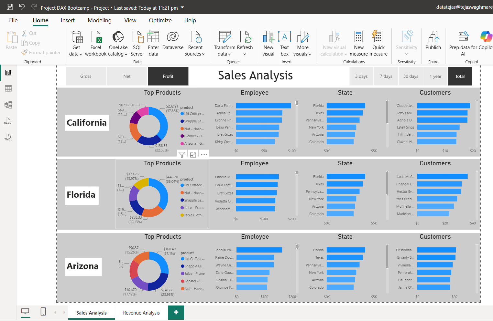
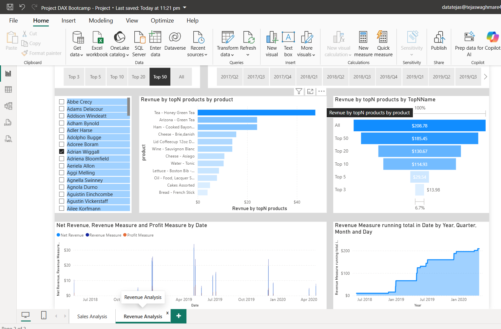

# 📊 Power BI DAX Mini Project | Sales & Revenue Analytics

> **Interactive Power BI dashboard demonstrating DAX-driven business analysis, Top-N product performance, regional sales comparison, profitability tracking, and time-intelligence analysis.**


---

## 🎯 Project Overview

This project demonstrates how **Power BI and DAX can be used to convert transactional sales data into actionable business insights**.

The primary focus was not just dashboard design, but the development of **dynamic DAX measures, calculated columns, ranking logic, Top-N analysis, and cumulative metrics** to answer common business performance questions.

The resulting dashboards provide an interactive view of:

* 📈 Sales and revenue performance
* 🏆 Top-performing products
* 🌎 State-wise sales performance
* 👥 Customer and employee contribution
* 💰 Revenue and profit trends
* ⏱️ Cumulative and running-total performance

> **Recruiter takeaway:** This project demonstrates practical experience with **Power BI, DAX, business-oriented KPIs, data visualization, and analytical thinking.**

---

# 💼 Business Questions Answered

The dashboard was designed around practical business questions rather than simply displaying charts.

### Product Performance

* Which products generate the highest revenue?
* How much revenue is contributed by the Top-N products?
* Which products should receive greater business attention?

### Regional Performance

* Which states are driving sales?
* How does sales performance differ across California, Florida, and Arizona?
* Which regions may require additional business focus?

### Customer & Employee Performance

* Which customers contribute the most to sales?
* Which employees demonstrate stronger sales performance?
* How does individual performance affect overall results?

### Revenue & Profitability

* What is the total revenue and profit?
* How does revenue change over time?
* How much revenue has accumulated throughout the reporting period?

---

# 📊 Dashboard Highlights

## 1. Sales Performance Analysis

The Sales Analysis dashboard provides an interactive view of sales performance across products, customers, employees, and states.

### Key Features

* State-wise sales comparison
* Product-level performance
* Customer contribution
* Employee performance
* Top-N product analysis
* Interactive filtering and exploration

### 📸 Dashboard



---

## 2. Revenue & Profit Analysis

The Revenue Analysis dashboard focuses on financial performance and demonstrates the use of DAX-based calculations and time-intelligence concepts.

### Key Features

* Total revenue
* Net revenue
* Profit analysis
* Revenue contribution
* Cumulative revenue
* Running totals
* Time-based performance analysis

### 📸 Dashboard



---

# 🧮 DAX Implementation

A major component of this project was applying DAX to create **dynamic and reusable business calculations**.

### Core DAX Functions

```text
CALCULATE()
FILTER()
RANKX()
SUMX()
SUM()
DIVIDE()
TOPN()
ALL()
```

### DAX Concepts Demonstrated

* Measure creation
* Calculated columns
* Filter context
* Context-aware calculations
* Iterator functions
* Ranking logic
* Top-N analysis
* Running totals
* Cumulative calculations
* Time-intelligence concepts

---

# 📌 Key DAX Use Cases

### 🏆 Top-N Product Analysis

Ranking logic was implemented to identify high-performing products and analyze their contribution to overall revenue.

**Business value:**
Enables stakeholders to quickly identify products that have the greatest impact on revenue.

---

### 📈 Running & Cumulative Revenue

DAX measures were used to calculate revenue accumulation over time.

**Business value:**
Helps management understand revenue growth patterns and monitor performance progression.

---

### 🌎 State-Level Performance

Sales were analyzed across multiple states to compare regional contribution.

**Business value:**
Provides a quick view of geographic performance and potential areas requiring attention.

---

### 💰 Revenue & Profit Metrics

Dynamic measures were created to calculate and compare revenue and profitability.

**Business value:**
Allows users to evaluate not only sales volume but also financial performance.

---

# 🛠️ Technology Stack

| Technology                | Purpose                                     |
| ------------------------- | ------------------------------------------- |
| **Power BI**              | Interactive dashboards & data visualization |
| **DAX**                   | Measures, calculations & analytical logic   |
| **Power Query**           | Data preparation & transformation           |
| **CSV / Structured Data** | Data source                                 |
| **Git & GitHub**          | Version control & project documentation     |

---

# 📂 Repository Structure

```text
PowerBi-Dax-Mini-Project/
│
├── dataset/
│   └── raw/
│       └── sales-revenue-datasets
│
├── pbix_files/
│   └── PowerBI_DAX_Mini_Project.pbix
│
├── screenshots/
│   ├── dashboard_page_1.png
│   └── dashboard_page_2.png
│
├── LICENSE
└── README.md
```

---

# 🔎 Analytical Skills Demonstrated

This project demonstrates practical capability in:

* **Business Intelligence**
* **Data Analysis**
* **DAX**
* **Power BI**
* **KPI development**
* **Data visualization**
* **Top-N analysis**
* **Ranking**
* **Time intelligence**
* **Revenue & profitability analysis**
* **Interactive dashboard development**
* **Business question formulation**

---

# 📈 What I Learned

Through this project, I strengthened my ability to move from **raw business data → analytical calculations → interactive dashboards → business insights**.

### Technical Learning

* Creating reusable DAX measures
* Understanding filter context
* Using iterator functions such as `SUMX()`
* Implementing ranking using `RANKX()`
* Building Top-N analysis with `TOPN()`
* Applying `CALCULATE()` and `FILTER()`
* Developing cumulative and running-total calculations
* Designing interactive Power BI reports

### Business Learning

* Translating business questions into analytical metrics
* Selecting appropriate KPIs
* Comparing regional performance
* Identifying high-value products
* Understanding revenue and profitability trends
* Presenting analytical results through data visualization

---

# 🎓 Course & Certification

This project was completed as part of my hands-on learning through a **Udemy Power BI/DAX course**, where I applied concepts related to **DAX measures, calculated columns, and Power BI analysis**.

### 📜 Course Certificate

[**View my Udemy Certificate →**](https://www.udemy.com/certificate/UC-e51ff69d-f671-4db6-80d7-95f14354df14/)

> **Important:** The course provided the learning foundation; this repository demonstrates my practical application of those concepts through a complete Power BI project.

---

# 🚀 How to Explore the Project

### 1. Clone the repository

```bash
git clone https://github.com/TCWaghmare/PowerBi-Dax-Mini-Project.git
```

### 2. Open the Power BI file

Open the `.pbix` file using **Power BI Desktop**.

### 3. Explore the dashboards

Interact with:

* KPIs
* Slicers
* Product analysis
* State-level analysis
* Revenue trends
* Customer and employee analysis

### 4. Review the DAX

Explore the measures and calculated columns used to generate the analytical metrics.

---

# 📸 Project Preview

| Sales Analysis                              | Revenue Analysis                               |
| ------------------------------------------- | ---------------------------------------------- |
|  |  |

---

# 👨‍💻 About Me

**Tejas Waghmare**

Aspiring **Data Analyst / Business Intelligence Professional** with an engineering background and hands-on experience in **SQL, Power BI, DAX, Excel, and data analytics projects**.

I am interested in transforming raw data into **meaningful business insights and decision-support dashboards**.

### 🔗 Connect

* **LinkedIn:** [linkedin.com/in/tejascwaghmare](https://www.linkedin.com/in/tejascwaghmare/)
* **GitHub:** [github.com/TCWaghmare](https://github.com/TCWaghmare)

---

## ⭐ Project Value

This project represents my practical progression from **learning DAX concepts to applying them in a business-oriented Power BI dashboard**.

**Data → DAX → Analysis → Visualization → Business Insight**
